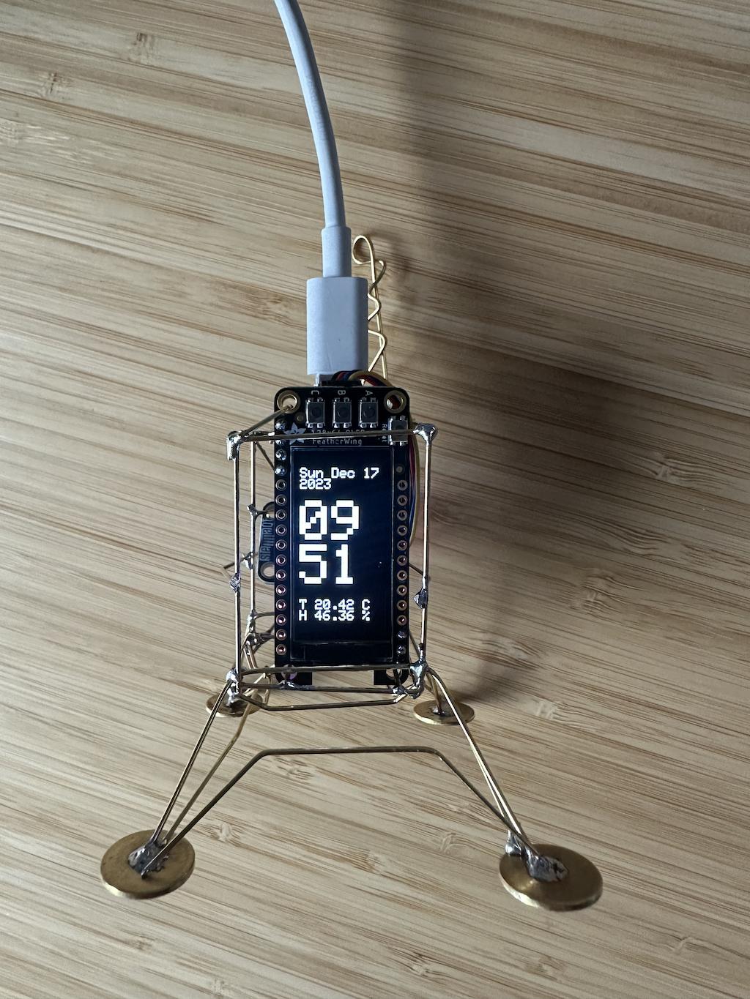
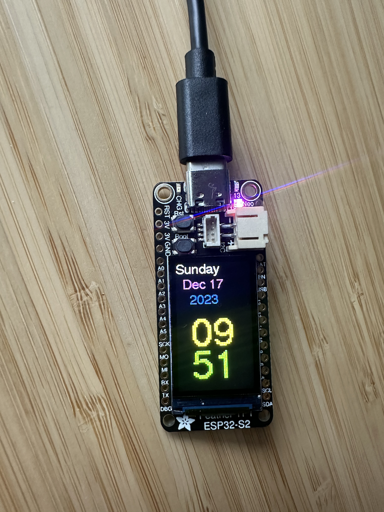

# ESP32 clock watch date project

## Adafruit lander 

is a project for date / clock / watch designed for:

[Adafruit ESP32 Feather V2](https://www.adafruit.com/product/5400)

with:

[Adafruit 128x64 OLED FeatherWing](https://learn.adafruit.com/adafruit-128x64-oled-featherwing)

and 

[Adafruit AHT20 - Temperature & Humidity Sensor Breakout Board](https://www.adafruit.com/product/4566)

## Adafruit TFT lander 

is a project for date / clock / watch designed for:

[Adafruit ESP32-S2 TFT Feather](https://learn.adafruit.com/adafruit-esp32-s2-tft-feather/built-in-tft)

## References

inspired by

[1 - Boron Lander](https://www.hackster.io/mohit/boron-lander-7f08b5)

[2 - ESP32 NTP server date and time](https://lastminuteengineers.com/esp32-ntp-server-date-time-tutorial/)